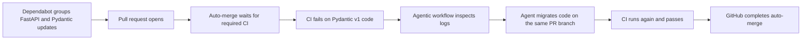

# Agentic Dependabot repair

A minimal, deliberately vulnerable FastAPI application that demonstrates
[GitHub Agentic Workflows](https://github.github.com/gh-aw/introduction/overview/)
taking over when a Dependabot pull request cannot be auto-merged because its
tests fail.

> [!WARNING]
> The default branch intentionally pins a vulnerable FastAPI version. This is a
> demonstration repository, not a deployable application.

## The scenario



The baseline uses:

- `fastapi==0.63.0`, which is affected by
  [GHSA-8h2j-cgx8-6xv7](https://github.com/advisories/GHSA-8h2j-cgx8-6xv7)
- `pydantic==1.10.13`
- a Pydantic v1 `root_validator` and v1 model configuration

Dependabot is restricted to FastAPI and Pydantic and groups their updates into
one pull request. A current Pydantic v2 upgrade makes test collection fail. The
compiled agentic workflow is triggered only when the `CI` workflow fails for
Dependabot, and can push only to a pull request carrying the `agent-repair`
label. Its file writes are allowlisted.

## Repository tour

- `app/main.py` — deliberately Pydantic v1 application code
- `tests/test_main.py` — behaviour the migration must preserve
- `.github/dependabot.yml` — grouped FastAPI and Pydantic updates
- `.github/workflows/ci.yml` — required test check
- `.github/workflows/dependabot-automerge.yml` — queues Dependabot PRs for
  auto-merge; required checks still gate the merge
- `.github/workflows/dependabot-repair.md` — human-readable agent instructions
- `.github/workflows/dependabot-repair.lock.yml` — compiled, hardened GitHub
  Actions workflow

## One-time setup

The repository owner must configure two secrets:

1. `COPILOT_GITHUB_TOKEN`: a fine-grained personal access token with the
   **Copilot Requests: read** account permission, used by the `copilot` engine.
2. `CI_TOKEN`: a fine-grained personal access token with **Contents: write** and
   **Pull requests: write** repository permissions. The safe-output push uses it
   only to add an empty commit that retriggers CI, because pushes made with the
   default Actions token do not start another workflow run.

Then enable Dependabot and GitHub Actions in the repository settings. The
default branch requires the `test` check and has auto-merge enabled.

## Run locally

Install [uv](https://docs.astral.sh/uv/), then run:

```shell
uv run --python 3.11 --with-requirements requirements-dev.txt python -m pytest
```

The baseline should pass. To reproduce the migration failure locally, update
FastAPI and Pydantic to current releases without changing `app/main.py`, then
run the same command.

## Edit the agentic workflow

Install the official extension and compile both the Markdown source and lock
file:

```shell
gh extension install github/gh-aw
gh aw compile
```

Commit both workflow files whenever the source changes. See the
[Agentic Workflows quickstart](https://github.github.com/gh-aw/setup/quick-start/)
and [security architecture](https://github.github.com/gh-aw/introduction/architecture/)
for the trust boundaries behind compilation, read-only agent permissions and
safe outputs.
